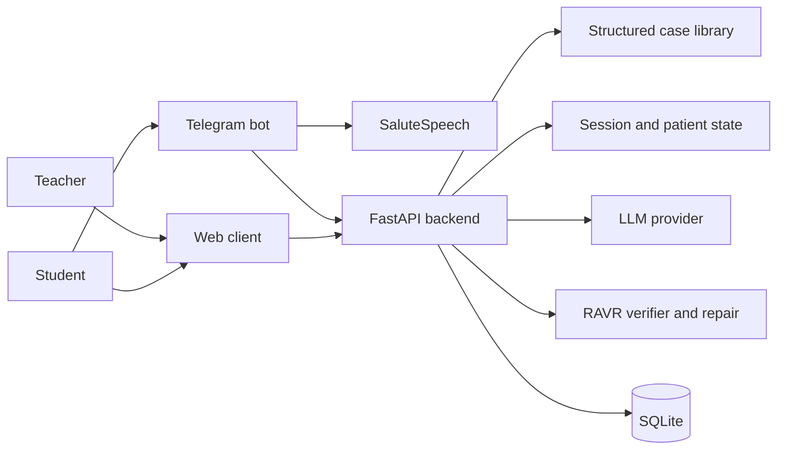

# Virtual Patient Simulator

[](https://github.com/YaroslavPelekhov/Virtual-Patient-Simulator/actions/workflows/tests.yml)


An educational platform for practicing psychological interviewing with stateful, LLM-driven virtual patients. The project combines a web interface, a Telegram bot with optional speech support, a teacher dashboard, and a verification layer for evaluating therapeutic dialogue moves.

> [!IMPORTANT]
> This is a research and training prototype. It is not a medical device, does not provide therapy or diagnosis, and must not be used for clinical decision-making or crisis support.

## Highlights

- **Stateful virtual patients** whose trust, emotional intensity, and fatigue evolve across a dialogue.
- **Structured training cases** with separate student-visible and teacher-only information.
- **Complete Russian and English editions** with localized cases, patient prompts, supervision, and methodology rules.
- **Teacher mode** with complete case profiles, session history, progress signals, and feedback.
- **Web and Telegram clients**, including optional speech-to-text and text-to-speech via SaluteSpeech.
- **Multiple LLM providers**: GigaChat, OpenAI, OpenAI-compatible endpoints, and OpenRouter.
- **RAVR verification and repair** for methodology-aware evaluation of therapist turns.
- **Research endpoints** for metrics, JSONL exports, ablations, and multi-model benchmarks.

The bundled simulator is available in Russian and English. Each language uses its own case library and session database when deployed as a separate backend instance.

## System Overview



At each turn, the backend evaluates the student's message, updates the interaction state, verifies methodology-specific constraints, generates the virtual patient's response, and persists the resulting session.

## Repository Layout

```text
.
├── backend/
│   ├── main.py                    # FastAPI application and RAVR pipeline
│   ├── virtual_patient_cases.json # Structured training cases
│   ├── virtual_patient_cases.en.json # English case edition
│   ├── requirements.txt
│   └── tests/
├── bot/
│   ├── bot.py                     # Telegram text and voice client
│   └── requirements.txt
├── frontend/
│   ├── index.html
│   ├── script.js
│   ├── style.css
│   └── en/                        # English web edition
├── docs/
│   ├── API.md
│   ├── CONFIGURATION.md
│   ├── DEPLOYMENT.md
│   └── RESEARCH.md
└── CONTRIBUTING.md
```

## Quick Start

### Prerequisites

- Python 3.10 or newer
- Credentials for at least one supported LLM provider
- A Telegram bot token only if the Telegram client is needed
- SaluteSpeech credentials only if voice input/output is needed

### 1. Start the backend

```bash
git clone https://github.com/YaroslavPelekhov/Virtual-Patient-Simulator.git
cd Virtual-Patient-Simulator/backend

python3 -m venv .venv
source .venv/bin/activate
pip install -r requirements.txt
cp .env.example .env
```

Edit `backend/.env` and configure one provider. For example, with OpenRouter:

```env
LLM_PROVIDER=openrouter
OPENROUTER_API_KEY=your_openrouter_key
OPENROUTER_MODEL_DEFAULT=openai/gpt-4o-mini
```

Run the API:

```bash
uvicorn main:app --reload --host 127.0.0.1 --port 8000
```

The default backend language is Russian. To run the English edition locally on a second port:

```bash
VP_LANGUAGE=en uvicorn main:app --reload --host 127.0.0.1 --port 8001
```

Useful local URLs:

- API documentation: <http://127.0.0.1:8000/docs>
- Case list: <http://127.0.0.1:8000/api/cases>
- Global RAVR metrics: <http://127.0.0.1:8000/api/ravr_metrics>

### 2. Start the web client

From the repository root:

```bash
python3 -m http.server 8080 --directory frontend
```

Open <http://127.0.0.1:8080> for Russian or <http://127.0.0.1:8080/en/> for English. The development frontends expect their backends at ports `8000` and `8001`, respectively.

### 3. Start the Telegram bot

```bash
cd bot
python3 -m venv .venv
source .venv/bin/activate
pip install -r requirements.txt
cp .env.example .env
```

Set `TELEGRAM_BOT_TOKEN` and `BACKEND_URL` in `bot/.env`, then run:

```bash
python bot.py
```

Voice messages require `SALUTESPEECH_AUTH_KEY`. Text mode works without speech credentials.

## Core Workflow

1. A student selects a training case and starts a session.
2. The student writes a therapist message through the web or Telegram client.
3. The backend evaluates empathy, validation, directivity, safety, and related signals.
4. The patient's trust, emotional intensity, and fatigue are updated.
5. RAVR checks methodology-specific constraints and creates a proof object.
6. The configured LLM generates the next patient response from the case profile, state, and dialogue history.
7. Teacher mode exposes the trajectory, progress indicators, and verification results.

## API Example

```bash
curl -X POST http://127.0.0.1:8000/api/chat \
  -H 'Content-Type: application/json' \
  -d '{
    "session_id": "demo-session",
    "case_id": "gtr_01",
    "user_message": "What feels most difficult for you right now?",
    "teacher_mode": true,
    "llm_provider": "openrouter"
  }'
```

The teacher-mode response may include the turn evaluation, methodology proof object, verifier result, and detected violations in addition to the virtual patient's reply.

See [API Reference](docs/API.md) for all endpoints.

## Configuration

Provider credentials and feature switches are loaded from `backend/.env` and `bot/.env`. Both files are ignored by Git. Start from the committed `.env.example` files and never commit real API keys or bot tokens.

Supported backend provider values include:

- `gigachat`
- `openai`
- `openai_compatible`
- `openrouter`
- `openrouter_gpt`
- `openrouter_claude`
- `openrouter_gemini`
- `openrouter_deepseek`
- `openrouter_qwen`

See [Configuration](docs/CONFIGURATION.md) for all variables and RAVR/RAVR-S switches.

## Verification and Research Mode

The backend includes a methodology-aware verification pipeline that returns:

- satisfied and violated constraints;
- supporting evidence and retrieved rule chunks;
- citation validity, coverage, precision, and relevance;
- adherence scores;
- targeted repair suggestions and re-verification results.

Research endpoints export session-level metrics and turn-level datasets and can run controlled benchmark and ablation configurations. See [Research Guide](docs/RESEARCH.md).

## Tests

The test suite uses mocked provider calls and does not require paid API access:

```bash
cd backend
source .venv/bin/activate
pip install -r requirements-dev.txt
python -m unittest discover -s tests -v
```

## Deployment

Do not expose the development server directly to the internet. A production installation should use a dedicated service account, a process supervisor, HTTPS termination, restricted CORS, firewall rules, secret storage, and access control for teacher endpoints.

The previous development VPS is not treated as a supported deployment target. Follow [Deployment Guide](docs/DEPLOYMENT.md) to create a fresh and auditable installation.

## Responsible Use

- Use synthetic or explicitly consented data only.
- Do not enter identifiable patient information.
- Keep teacher-only case details and session exports access-controlled.
- Do not rely on generated responses or verifier scores for diagnosis, treatment, or emergency decisions.
- Keep a qualified instructor responsible for reviewing educational use.
- Direct real emergencies to local emergency and crisis services.

## Contributing

Issues and pull requests are welcome. Before proposing a change, read [CONTRIBUTING.md](CONTRIBUTING.md). Changes to clinical cases, safety rules, or methodology constraints should include a rationale and tests.

Security concerns should be reported according to [SECURITY.md](SECURITY.md), not through a public issue.

## Project Status

Active research prototype. APIs and case schemas may change. Pin a commit hash for experiments and record the model identifier, provider, prompts, and configuration used in every run.
